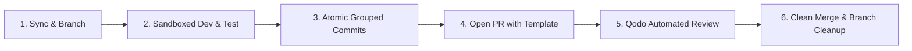

# 🤖 Autonomous Agent & Developer Workflow Guidelines
> **Protocol for Peak Efficiency, Clean Commit Architecture, and Automated Quality Gates**

This guide defines the standardized operating procedures for autonomous coding agents (and human engineers) contributing to **OmniForge**. Adhering to these rules ensures maximum development velocity, zero merge conflicts, and flawless test/review records with **Qodo**.

---

## 🎯 Core Operating Principles



---

## 1. 🌿 Branching & Sync Protocol

### A. Pre-Branch Synchronization (MANDATORY)
Before starting any new task, feature, or bugfix, ensure your local workspace is 100% synchronized with upstream:
```bash
# Always sync main before creating a feature branch
git checkout main
git pull --rebase origin main
git status  # Must report: "nothing to commit, working tree clean"
```

### B. Branch Naming Conventions
Always use structured, descriptive branch prefixes:
* `feat/<scope>-<description>` $\to$ e.g., `feat/sre-mcp-log-fetcher`
* `fix/<scope>-<description>` $\to$ e.g., `fix/hitl-approval-timeout`
* `docs/<description>` $\to$ e.g., `docs/add-agent-guidelines`
* `test/<description>` $\to$ e.g., `test/sandbox-exploit-simulation`
* `refactor/<scope>` $\to$ e.g., `refactor/orchestrator-memory`

```bash
# Create and switch to new branch in one command
git checkout -b feat/sre-mcp-log-fetcher
```

---

## 2. 📦 Atomic & Grouped Commit Standards

### A. Strict Conventional Commit Format
Every commit message must follow the Conventional Commits specification:
```text
<type>(<scope>): <short imperative summary>

[optional detailed body explaining why, trade-offs, or design decisions]
```

**Allowed Types:**
* `feat`: New feature or user-facing capability.
* `fix`: Bugfix or patch.
* `docs`: Documentation updates or additions.
* `test`: Adding or modifying unit, integration, or E2E tests.
* `refactor`: Code change that neither fixes a bug nor adds a feature.
* `chore`: Build scripts, dependencies, tooling, or configuration.
* `ci`: GitHub Actions, workflows, or Qodo configuration.

### B. Group Changes Granularly (Never Bulk Commit)
* **Rule:** Do NOT commit disparate modules together (e.g., mixing UI components, backend routes, and documentation in a single commit).
* **Rule:** Stage and commit related files in logical clusters:
```bash
# Example: Grouping commits logically
git add packages/mcp-tools/src/system/
git commit -m "feat(mcp): add system metric and container log tool handlers"

git add apps/server/src/policies/hitl.ts
git commit -m "feat(server): implement HITL policy rule for destructive system commands"

git add docs/
git commit -m "docs: document system MCP tool specifications and HITL triggers"
```

### C. Hygiene & Secret Prevention
* **Never commit:** `.env`, `.env.local`, API keys, session tokens, `.DS_Store`, `tmp/`, or `node_modules/`.
* Always verify `git status` and `.gitignore` before staging.

---

## 3. 🚀 Pull Request & Qodo Review Loop

### A. PR Creation Standards
Open all Pull Requests using the GitHub CLI with a structured title and body:
```bash
gh pr create \
  --title "feat(mcp): implement system log fetcher and container metrics" \
  --body "### Summary of Changes
- Added FastMCP tool server for Docker container log extraction.
- Configured CPU/Memory metric collector.
- Added unit tests in \`packages/mcp-tools\`.

### Judging Track Impact
- **Double-O Track:** Expands TrueForge tool connectivity via MCP.
- **Q Branch Track:** Full unit test coverage verified by Qodo." \
  --base main
```

### B. Automated Qodo Review Loop
1. Once the PR is opened, **Qodo PR-Agent** will automatically trigger and comment within 30–60 seconds.
2. Review Qodo's automated feedback:
   * **Automated Architecture Diagram:** Verify component dependencies match intent.
   * **Security & Edge-Case Warnings:** Address any flagged security risks immediately.
3. Interactive Qodo Commands in PR Comments:
   * `@qodo-code-review /review` $\to$ Re-triggers comprehensive code review.
   * `@qodo-code-review /improve` $\to$ Suggests specific code improvements and refactors.
   * `@qodo-code-review /test` $\to$ Automatically generates additional edge-case unit tests.

---

## 4. 🔀 Merging & Conflict-Free Cleanup

### A. Clean Merge Protocol
Once the PR has passed tests and received Qodo sign-off:
```bash
# Merge PR using fast-forward or standard merge, and delete remote branch
gh pr merge <PR-NUMBER> --merge --delete-branch

# Switch back to main and pull the merged changes
git checkout main
git pull origin main

# Delete local branch
git branch -d <branch-name>
```

### B. Merge Conflict Resolution Protocol
If `main` has advanced while working on a feature branch:
```bash
# Fetch latest main
git fetch origin main

# Rebase feature branch onto latest main
git rebase origin/main

# If conflicts occur: resolve them in files, then:
git add <resolved-files>
git rebase --continue

# Force-push with lease to update the PR branch safely
git push --force-with-lease origin <branch-name>
```

---

## 5. 🛡️ TrueForge Runtime & Sandboxing Rules for Agents

When building or extending agent tools inside OmniForge:

| Operation Type | Where It Must Execute | Policy / Governance |
| :--- | :--- | :--- |
| **Log reading, metrics, search** | Local Node/Python runtime | Safe (Auto-approved) |
| **Dynamic script / Exploit testing** | **Isolated Docker Sandbox ONLY** | Safe inside container |
| **Git write / PR creation** | Host Git environment | Requires HITL Token |
| **Destructive Infra Commands** (`rm`, `kill`, `restart`) | Host environment | **HALT for Human 1-Click Approval** |
| **Database DDL / DML write** | Target Database | **HALT for Human 1-Click Approval** |

---

## ⚡ Agent CLI Quick Reference

```bash
# Quick status check
git status -s

# Check branch visual history
git log --oneline --graph --decorate -n 10

# Push branch and set upstream
git push -u origin <branch-name>

# View active PR comments and Qodo reviews
gh pr view <PR-NUMBER> --comments

# Run monorepo typecheck & build test
npm run build
```
