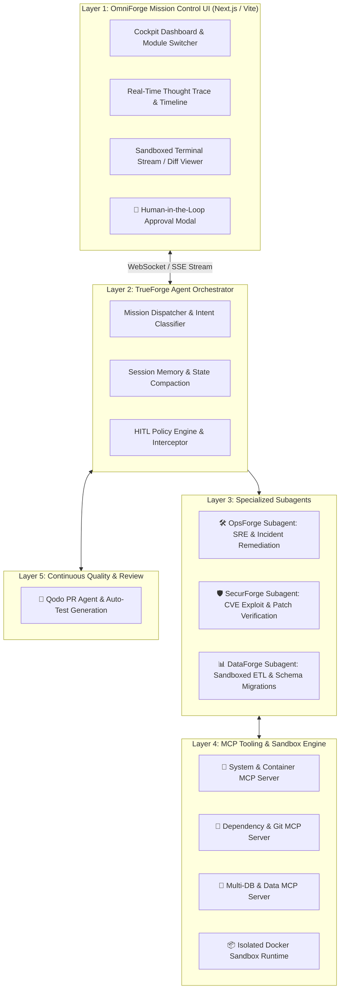

# 🏗️ OmniForge: Technical Architecture Specification

OmniForge is an **Autonomous Multi-Agent Mission Control Platform** engineered on top of [TrueForge](https://github.com/truefoundry/trueforge) and the [Model Context Protocol (MCP)](https://modelcontextprotocol.io).

---

## 🧩 System Architecture



---

## 🛠️ The 3 Subagent Modules

### 1. 🛠️ OpsForge (SRE & Incident Remediation)
* **Goal:** Detect server outages, inspect Kubernetes/Docker logs, run diagnostics safely, and remediate failures.
* **Tools Used:** System metric MCP, container log fetcher, bash execution sandbox.
* **HITL Trigger Point:** Any destructive operation (`docker restart`, `kubectl delete`, `kill -9`, `rm`).

### 2. 🛡️ SecurForge (AppSec & Patch Verification)
* **Goal:** Ingest CVE vulnerability feeds, simulate exploits inside the Docker sandbox, generate patches, and run test suites.
* **Tools Used:** Dependency scanner MCP, Git MCP, sandboxed exploit runner.
* **HITL Trigger Point:** Pull request creation and committing changes to production branches.
* **Qodo Synergy:** Qodo automatically runs test generation to verify no regressions occur.

### 3. 📊 DataForge (DataOps & Sandboxed ETL)
* **Goal:** Ingest data across disparate databases (PostgreSQL, ClickHouse, CSVs), write Python transformation scripts in sandbox, and validate schemas.
* **Tools Used:** Database query MCP, Python data science sandbox (Pandas, Polars, DuckDB).
* **HITL Trigger Point:** Any `UPDATE`, `DELETE`, `DROP TABLE`, or schema migration.

---

## 🛑 Human-in-the-Loop (HITL) Gate Matrix

TrueForge intercepts every tool call request before execution. If the tool action matches a high-risk policy rule, the runtime pauses and generates an approval token:

| Tool Action Category | Risk Level | Execution Mode | Approval Requirement |
| :--- | :---: | :--- | :--- |
| `read_logs`, `get_metrics`, `inspect_code` | 🟢 LOW | Sandboxed / Local | Auto-Executed (No approval needed) |
| `run_diagnostic_script`, `test_exploit` | 🟡 MEDIUM | **Isolated Docker Sandbox Only** | Auto-Executed in Sandbox |
| `git_commit`, `create_pull_request` | 🟠 HIGH | Host Git Environment | **Human Review & Sign-Off** |
| `docker_restart`, `kubectl_apply`, `systemctl` | 🔴 CRITICAL | Host / Target Infra | **Explicit Human 1-Click Confirmation** |
| `db_drop_table`, `db_update_bulk` | 🔴 CRITICAL | Target Database | **Explicit Human 1-Click Confirmation** |

---

## 📦 Directory Structure & Component Layout

```text
omniforge/
├── .github/
│   └── workflows/
│       ├── qodo_review.yml       # Qodo PR Agent integration
│       └── test_ci.yml           # Automated unit/integration tests
├── .pr_agent.toml                # Qodo configuration file
├── apps/
│   ├── web/                      # React / Next.js Cockpit Dashboard
│   │   ├── src/
│   │   │   ├── components/
│   │   │   │   ├── CockpitLayout.tsx
│   │   │   │   ├── AgentTimeline.tsx    # Live step-by-step reasoning trace
│   │   │   │   ├── ApprovalModal.tsx    # Interactive HITL confirmation dialog
│   │   │   │   ├── TerminalStream.tsx   # Live sandboxed stdout/stderr
│   │   │   │   └── ModuleSwitcher.tsx   # Switch between Ops, Sec, Data
│   │   │   └── styles/
│   └── server/                   # TrueForge Agent Orchestrator Engine
│       ├── src/
│       │   ├── orchestrator.ts   # Subagent dispatcher & memory loop
│       │   ├── policies/         # HITL risk rules & interceptor gates
│       │   └── routes/           # WebSocket & REST streaming endpoints
├── packages/
│   ├── mcp-tools/                # FastMCP Tool Servers
│   │   ├── system-mcp/           # Logs, Docker, system metrics
│   │   ├── security-mcp/         # CVE scanners, git diff tools
│   │   └── data-mcp/             # DB connectors (Postgres, DuckDB)
│   └── sandbox/                  # Dockerized Sandbox Execution Container
│       ├── Dockerfile
│       └── runner.py
├── docs/                         # Comprehensive project documentation
├── package.json
└── README.md
```
