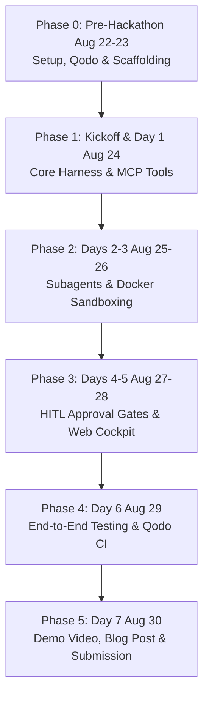

# 🚀 OmniForge: Step-by-Step Implementation Playbook

This playbook provides an actionable roadmap from pre-hackathon preparation to final submission.

---

## 📅 Execution Phases



---

## 📋 Phase 0: Pre-Hackathon Setup (August 22 – 23)

### Goal: Zero Friction at Kickoff
- [x] Create project repository: [`gaminbhoot/omniforge`](https://github.com/gaminbhoot/omniforge).
- [ ] Confirm registration on the [WeMakeDevs Portal](https://www.wemakedevs.org/hackathons/trueforge).
- [ ] Star the official [TrueForge GitHub Repository](https://github.com/truefoundry/trueforge) — **also enters Calling Card draw for Logitech MX Master 3** (no project required, per kick-off guide).
- [ ] Verify local runtimes:
  ```bash
  node -v     # v22+ required for TrueForge (per kick-off guide); v20 works for OmniForge stub
  python3 --version  # 3.11+
  docker --version   # Docker running
  ```
- [ ] **Qodo — connect via kick-off flow (5 steps):**
  1. Create account at [app.qodo.ai/signin](https://app.qodo.ai/signin) (Google/GitHub/email) — accept team invite first if invited
  2. Link Git account so Qodo identifies you across PRs/commits → install Qodo app on `omniforge` repo (gives `github.com/apps/qodo-merge`)
  3. (Optional) Connect Jira / Linear / Azure DevOps to tie changes to issues
  4. Keep `.pr_agent.toml` in repo root (already there) — either GitHub App or `app.qodo.ai` satisfies Q Branch if PRs show review comments + fixes
  5. Open PR #1 early — Qodo should comment with repo-context review
- [ ] Add `.pr_agent.toml` to repository root (done) + verify on throwaway PR.

---

## 📋 Phase 1: Kickoff & Day 1 (August 24)

### Goal: TrueForge Core Engine & MCP Tool Connectivity — 7 Steps from Kick-off Guide
1. **Attend Kickoff Livestream (8:00 AM London / 8:00 AM PDT):**
   - Collect any special sponsor API keys / credits provided by TrueFoundry & Qodo.
2. **Run TrueForge (per guide, Node 22+):**
   ```bash
   npx @truefoundry/trueforge   # → http://localhost:8790  SQLite local, keep on localhost
   ```
   - Configure session memory storage (SQLite local is default; Redis/Postgres for hosted).
3. **Add model provider:** `http://localhost:8790 → Settings → Models` → choose from catalog → add API key → models become selectable (we use `muse-spark-1.2-contributor` via `https://api.meta.ai/v1`)
4. **Connect MCP tools:** `Settings → Connectors` → pick from built-in catalog (`exa`, `deepwiki`) or add by URL → agent can then *use* tools (we also have local `packages/mcp-tools/{system,security,data}-mcp` via stdio for OmniForge server stub)
5. **Add skill:** `Settings → Skills` → `SKILL.md` instruction packs (git-backed) → enable from built-ins or import from GitHub. *Tools = capabilities; skills = reusable instructions.* (OmniForge maps skills to prompt templates in `apps/server/src/policies/`)
6. **Add sandbox:** `Settings → Sandbox providers → Daytona` → create API key → save. *Local `docker compose up -d sandbox` (`omniforge-sandbox` 512m/1cpu) is the dev fallback — Daytona is the hosted isolated exec.*
7. **Compose & save agent:** Chat → choose model → `Tools` → enable `Connectors`, `Skills`, `Dynamic sub-agents`, `Sandbox` → `Save Agent` → name + instructions → appears in `Agents Library`. We created `ops-forge / secur-forge / data-forge` on `anthropic/muse-spark-12`.
8. **Open Pull Request #1:**
   - Verify that **Qodo** (via `app.qodo.ai` or `github.com/apps/qodo-merge`) automatically comments on PR #1 with repo-context code analysis. Fix what it finds — don't wait until submission day.

---

## 📋 Phase 2: Subagents & Sandboxing (August 25 – 26)

### Goal: Safe Execution Inside Isolated Sandboxes — Showcase "agent does work"
1. **Construct Sandbox Container:**
   - Local: `packages/sandbox` Docker (`python:3.11-slim`, `runner.py`, `agent:1000`, `mem 512m/cpus 1/cap_drop ALL/no-new-privileges`) — `docker compose up -d sandbox && docker exec ... python /usr/local/bin/runner.py`
   - Hosted: `Daytona` via `Settings → Sandbox providers` (per kick-off guide) — agent requests sandbox as a tool when it needs to execute code/files. Our `sandboxExec.ts` is fail-closed in prod (`SANDBOX_DOCKER=true` or `NODE_ENV=production` throws if Docker unavailable).
2. **Implement Subagent Specialization + Skills:**
   - **OpsForge:** prompt template + skill instructions for SRE incident diagnosis (logs→metrics→diagnostic `run_diagnostic_script` in sandbox → `restart_service` HITL)
   - **SecurForge:** `scan_dependencies` → `test_exploit` in sandbox → patch + `create_patch_pr` (HIGH HITL) + Qodo verification
   - **DataForge:** `load_csv` → `run_etl_script` (pandas/duckdb in sandbox) → `validate_schema` → `execute_write` CRITICAL HITL
   - Skills are `SKILL.md` packs (TrueForge) or `apps/server/src/policies/` prompt files (OmniForge stub) — reusable instructions for using tools.
3. **Integrate Subagent Router:**
   - TrueForge `Dynamic sub-agents` + our `policies/router.ts` (keyword `ops|security|data`) → dispatcher. TrueForge agents now: `ops-forge`, `secur-forge`, `data-forge` on `anthropic/muse-spark-12` with `sandbox:true` and `mcp_servers:[deepwiki, exa]` (remote, `@all` tools).

---

## 📋 Phase 3: Human-in-the-Loop (HITL) & Cockpit UI (August 27 – 28)

### Goal: Interactive Visual Control & Approval Governance — "stop and ask a human"
1. **Implement TrueForge Approval Gate Interceptor (per kick-off guide: "stopping and asking a human before an important action"):**
   - `policies/hitl.ts` tier: `LOW→auto`, `MEDIUM→sandbox-only (run_diagnostic_script, test_exploit, run_etl_script, validate_schema)`, `HIGH (create_patch_pr) / CRITICAL (restart_service, execute_write)` → pause and publish `approval_request{token, command, params, risk}` to WebSocket/SSE.
   - TrueForge `require_approval_for_tools: ["@write","@destructive"]` on `mcp_servers` mirrors this.
2. **Build the OmniForge Mission Control UI (`apps/web`):**
   - **Agent Thought Timeline:** step-by-step reasoning + tool calls (Savile Row polish — still wins crowd, even though kick-off guide folds UI into Double-O/Q Branch)
   - **Interactive Approval Modal:** 1-click "Approve" / "Reject with Feedback" + parameter diff viewer
   - **Terminal Output Stream:** live stdout/stderr from Docker/Daytona sandbox
   - **Module Switcher:** Ops / Sec / Data — one UI tells three stories (ops-fix, CVE-patch, ETL-validate)

---

## 📋 Phase 4: Verification, Qodo Code Review & Hardening (August 29)

### Goal: High Engineering Rigor for the "Q Branch" Track — "build it like real software"
1. **Automated Unit & Integration Tests:**
   - Write comprehensive tests for the agent orchestrator, policy engine, and MCP servers.
   - Use **Qodo Gen** to generate edge-case and regression tests (Qodo reviews with full repo context, per kick-off guide — not just diff).
2. **Pull Request Review Audit:**
   - Verify all PRs have been reviewed by Qodo (via `app.qodo.ai` or `github.com/apps/qodo-merge`) with 0 unresolved critical warnings. Fix what Qodo finds before merging — don't wait until submission day.
3. **End-to-End Walkthrough Testing:**
   - Test full Ops incident simulation: Outage alert $\to$ Sandbox diagnosis (Docker/Daytona) $\to$ HITL approval $\to$ Resolution.
   - Test full Secur incident: CVE detection $\to$ Sandbox exploit proof $\to$ Qodo patch verification $\to$ HITL approval $\to$ PR creation.
   - Test full Data incident: Data request $\to$ Sandbox ETL script $\to$ Schema validation $\to$ HITL approval $\to$ Commit.

---

## 📋 Phase 5: Submission & Video Production (August 30)

### Goal: High-Impact Presentation Before 8:00 PM London Deadline
1. **Record a 3-Minute Demonstration Video:**
   - *0:00 - 0:30:* The problem with unmonitored LLM agents (unsafe execution, lack of human oversight).
   - *0:30 - 1:15:* OmniForge architecture (TrueForge harness + MCP + Docker Sandbox).
   - *1:15 - 2:30:* Live demo showcasing an agent action triggering the **HITL approval modal** and sandboxed terminal output.
   - *2:30 - 3:00:* Qodo PR review trail, code quality, and closing summary.
2. **Publish Technical Blog Post (Field Report Track):**
   - Publish on Dev.to / Medium / Hashnode covering architecture, challenges, and TrueForge integration.
3. **Final Submission on WeMakeDevs Portal:**
   - Submit public GitHub URL: `https://github.com/gaminbhoot/omniforge`
   - Submit video demo URL (YouTube / Loom)
   - Submit live demo / blog post link before **August 30, 2026 @ 8:00 PM London time**.

