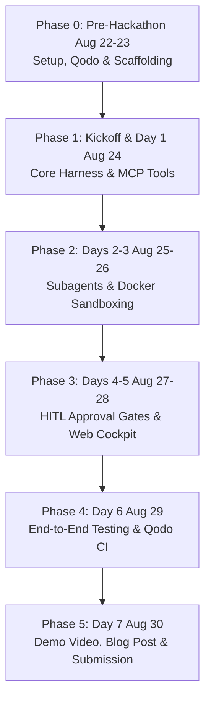

# 🚀 OmniForge: Step-by-Step Implementation Playbook

This playbook provides an actionable roadmap from pre-hackathon preparation to final submission.

---

## 📅 Execution Phases



---

## 📋 Phase 0: Pre-Hackathon Setup (August 22 – 23)

### Goal: Zero Friction at Kickoff
- [x] Create project repository: [`gaminbhoot/omniforge`](https://github.com/gaminbhoot/omniforge).
- [ ] Confirm registration on the [WeMakeDevs Portal](https://www.wemakedevs.org/hackathons/trueforge).
- [ ] Star the official [TrueForge GitHub Repository](https://github.com/truefoundry/trueforge) (required for prize draw).
- [ ] Install [Qodo PR-Agent](https://github.com/apps/qodo-merge) on the `omniforge` repository.
- [ ] Add `.pr_agent.toml` to repository root.
- [ ] Verify local runtimes:
  ```bash
  node -v     # v20+ recommended
  python3 --version  # 3.11+
  docker --version   # Docker running
  ```

---

## 📋 Phase 1: Kickoff & Day 1 (August 24)

### Goal: TrueForge Core Engine & MCP Tool Connectivity
1. **Attend Kickoff Livestream (8:00 AM London / 8:00 AM PDT):**
   - Collect any special sponsor API keys / credits provided by TrueFoundry & Qodo.
2. **Initialize TrueForge Harness:**
   - Initialize `@truefoundry/trueforge` backend service.
   - Configure session memory storage (SQLite / Redis).
3. **Build MCP Tool Servers:**
   - `packages/mcp-tools/system-mcp`: Exposes system monitoring & log retrieval.
   - `packages/mcp-tools/security-mcp`: Exposes dependency audit & git diff tools.
   - `packages/mcp-tools/data-mcp`: Exposes DuckDB / SQLite data ingestion tools.
4. **Open Pull Request #1:**
   - Verify that **Qodo PR-Agent** automatically comments on PR #1 with code analysis.

---

## 📋 Phase 2: Subagents & Sandboxing (August 25 – 26)

### Goal: Safe Execution Inside Isolated Sandboxes
1. **Construct Docker Sandbox Container:**
   - Build a lightweight, secure Docker container (`packages/sandbox`) with Python 3, bash, and standard diagnostic utilities.
   - Ensure the sandbox is isolated (no access to host filesystem; constrained memory/CPU).
2. **Implement Subagent Specialization:**
   - **OpsForge Subagent:** Prompt templates and routing for SRE incident diagnosis.
   - **SecurForge Subagent:** Exploit simulation logic and patch proposal pipeline.
   - **DataForge Subagent:** Data transformation and schema validation runner.
3. **Integrate Subagent Router:**
   - TrueForge router classifies user incoming requests and dispatches to the appropriate specialized subagent.

---

## 📋 Phase 3: Human-in-the-Loop (HITL) & Cockpit UI (August 27 – 28)

### Goal: Interactive Visual Control & Approval Governance
1. **Implement TrueForge Approval Gate Interceptor:**
   - Intercept dangerous tool calls (`restart`, `git commit`, `drop table`).
   - Pause agent execution and publish an approval request token to the WebSocket/SSE feed.
2. **Build the OmniForge Mission Control UI (`apps/web`):**
   - **Agent Thought Timeline:** Visual component showing step-by-step reasoning and tool calls.
   - **Interactive Approval Modal:** 1-click "Approve" or "Reject with Feedback" buttons with parameter diff viewer.
   - **Terminal Output Stream:** Live stdout/stderr feed from the Docker sandbox.
   - **Module Switcher:** Seamlessly switch between OpsForge, SecurForge, and DataForge views.

---

## 📋 Phase 4: Verification, Qodo Code Review & Hardening (August 29)

### Goal: High Engineering Rigor for the "Q Branch" Track
1. **Automated Unit & Integration Tests:**
   - Write comprehensive tests for the agent orchestrator, policy engine, and MCP servers.
   - Use **Qodo Gen** to generate edge-case and regression tests.
2. **Pull Request Review Audit:**
   - Verify all PRs have been reviewed by Qodo PR-Agent with 0 unresolved critical warnings.
3. **End-to-End Walkthrough Testing:**
   - Test full Ops incident simulation: Outage alert $\to$ Sandbox diagnosis $\to$ HITL approval $\to$ Resolution.
   - Test full Secur incident: CVE detection $\to$ Sandbox exploit proof $\to$ Qodo patch verification $\to$ HITL approval $\to$ PR creation.
   - Test full Data incident: Data request $\to$ Sandbox ETL script $\to$ Schema validation $\to$ HITL approval $\to$ Commit.

---

## 📋 Phase 5: Submission & Video Production (August 30)

### Goal: High-Impact Presentation Before 8:00 PM London Deadline
1. **Record a 3-Minute Demonstration Video:**
   - *0:00 - 0:30:* The problem with unmonitored LLM agents (unsafe execution, lack of human oversight).
   - *0:30 - 1:15:* OmniForge architecture (TrueForge harness + MCP + Docker Sandbox).
   - *1:15 - 2:30:* Live demo showcasing an agent action triggering the **HITL approval modal** and sandboxed terminal output.
   - *2:30 - 3:00:* Qodo PR review trail, code quality, and closing summary.
2. **Publish Technical Blog Post (Field Report Track):**
   - Publish on Dev.to / Medium / Hashnode covering architecture, challenges, and TrueForge integration.
3. **Final Submission on WeMakeDevs Portal:**
   - Submit public GitHub URL: `https://github.com/gaminbhoot/omniforge`
   - Submit video demo URL (YouTube / Loom)
   - Submit live demo / blog post link before **August 30, 2026 @ 8:00 PM London time**.

